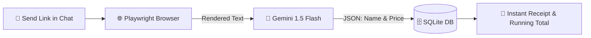

# 🛍️ Telegram AI Wishlist & Price Tracker

<div align="center">

[](https://www.python.org/)
[](https://core.telegram.org/bots)
[](https://playwright.dev/)
[](https://ai.google.dev/)
[](https://sqlite.org/)

An automated Telegram bot that converts product URLs into a tracked wishlist with running expense totals using **Playwright** and **Google Gemini AI**.

</div>

---

## ✨ Features

- 🔗 **Smart Link Detection**: Automatically parses e-commerce product links sent in chat.
- 🌐 **Dynamic JS Scraping**: Powered by headless **Playwright (Chromium)** to render complex, modern storefronts (Amazon, eBay, etc.).
- 🧠 **Structured AI Extraction**: Uses **Google Gemini 1.5 Flash** with strict JSON schemas to reliably extract product titles and clean numeric prices.
- 💰 **Expense Tracking**: Saves items in a local **SQLite** database and returns your updated cumulative wishlist cost instantly.

---

## 🔄 How It Works



---

## 🚀 Quick Start

### 1. Clone & Configure Environment

```bash
git clone https://github.com/your-username/telegram-wishlist-bot.git
cd telegram-wishlist-bot
```

Copy the example environment file:
```bash
cp .env.example .env
```

Open `.env` and insert your credentials:
```env
TELEGRAM_BOT_TOKEN=your_telegram_bot_token_here
GEMINI_API_KEY=your_gemini_api_key_here
```

> [!TIP]
> * Get your **Telegram Bot Token** from [@BotFather](https://t.me/BotFather).
> * Grab a free **Gemini API Key** from [Google AI Studio](https://aistudio.google.com/).

### 2. Install Dependencies

```bash
# Create and activate a virtual environment
python -m venv .venv
source .venv/bin/activate  # On Windows: .venv\Scripts\activate

# Install Python packages
pip install -r requirements.txt

# Download Playwright Chromium browser binaries
playwright install chromium
```

### 3. Run the Bot

```bash
python bot.py
```

---

## 💬 Usage

1. Open Telegram and search for your bot.
2. Send `/start` to begin.
3. Paste any product link (Amazon, BestBuy, eBay, etc.).
4. The bot will reply with the verified item details and your new total wishlist balance!

> [!IMPORTANT]
> Keep your `.env` private and never commit it to public version control. Add it to your `.gitignore`.

---

<div align="center">
  <sub>Built with ❤️ using Python, Playwright & Google Gemini</sub>
</div>
# wishlisttelegrambot
