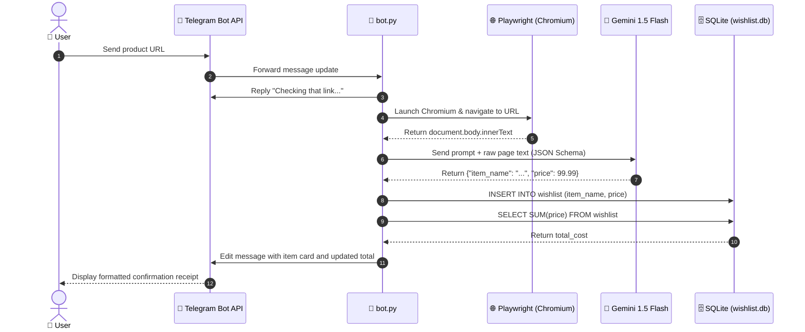
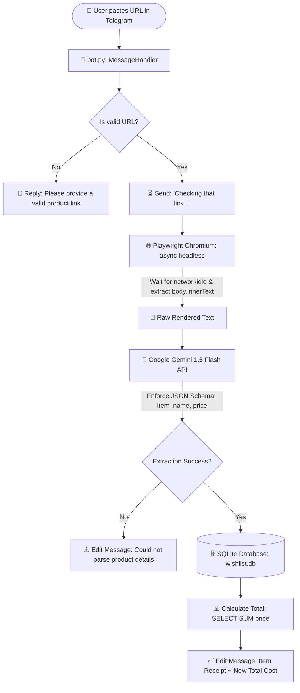

# 🛍️ Telegram AI Wishlist & Price Tracker

<div align="center">

[](https://www.python.org/)
[](https://core.telegram.org/bots)
[](https://playwright.dev/)
[](https://ai.google.dev/)
[](https://sqlite.org/)
[](https://opensource.org/licenses/MIT)

<p align="center">
  <strong>An automated, AI-powered Telegram bot that converts product URLs into a centralized, tracked wishlist with real-time cumulative expense accounting.</strong>
</p>

[Key Features](#-key-features) • [System Architecture](#-system-architecture) • [Installation & Setup](#-installation--setup) • [Configuration](#-configuration-reference) • [Usage Guide](#-usage-guide) • [Docker Deployment](#-production--background-deployment) • [Troubleshooting](#-troubleshooting--faq)

</div>

---

## 📑 Table of Contents

- [Overview](#-overview)
- [Key Features](#-key-features)
- [System Architecture](#-system-architecture)
  - [Workflow Flowchart](#workflow-flowchart)
  - [Detailed Sequence Diagram](#detailed-sequence-diagram)
- [Database Schema](#-database-schema)
- [Project Directory Structure](#-project-directory-structure)
- [Prerequisites](#-prerequisites)
- [Installation & Setup](#-installation--setup)
  - [1. Clone Repository](#1-clone-repository)
  - [2. Configure Environment Variables](#2-configure-environment-variables)
  - [3. Set Up Python Virtual Environment](#3-set-up-python-virtual-environment)
  - [4. Install Playwright Browsers](#4-install-playwright-browsers)
  - [5. Run the Bot](#5-run-the-bot)
- [Configuration Reference](#-configuration-reference)
- [Usage Guide](#-usage-guide)
  - [Commands](#commands)
  - [Adding Products](#adding-products)
  - [Supported Stores](#supported-stores)
- [Production & Background Deployment](#-production--background-deployment)
  - [Option A: Docker & Docker Compose](#option-a-docker--docker-compose)
  - [Option B: Linux systemd Service](#option-b-linux-systemd-service)
  - [Option C: PM2 Process Manager](#option-c-pm2-process-manager)
- [Troubleshooting & FAQ](#-troubleshooting--faq)
- [Roadmap](#-roadmap)
- [Contributing](#-contributing)
- [License](#-license)

---

## 💡 Overview

Shopping across various online retailers (Amazon, eBay, Best Buy, Walmart, niche e-commerce sites) usually leads to fragmented bookmarks, forgotten carts, and zero visibility into total prospective spending.

**Telegram AI Wishlist & Price Tracker** solves this problem by turning your Telegram chat into an intelligent personal budget & wishlist assistant:
1. **Send any link**: Paste a product link directly into the chat.
2. **Headless rendering**: Playwright spins up a headless Chromium browser instance to load and execute modern client-side JavaScript (SPAs).
3. **Structured AI Parsing**: The raw page content is fed to **Google Gemini 1.5 Flash** with strict JSON Schema constraints, pulling out only the authentic product title and normalized numerical price.
4. **Instant Accounting**: The item is cataloged into an embedded SQLite database, immediately calculating and displaying your new cumulative wishlist balance.

---

## ✨ Key Features

- 🔗 **Frictionless Link Ingestion**: Built-in URL regex extractor detects and parses links directly from natural chat messages.
- 🌐 **Full Headless JS Engine**: Utilizes **Playwright (Chromium)** with `networkidle` state detection to render heavy Single-Page Applications (SPAs) where standard `requests` or `curl` fail.
- 🧠 **Deterministic Gemini Extraction**: Leverages Google Gemini 1.5 Flash's JSON Schema mode (`response_schema`), eliminating hallucinated responses and enforcing exact numeric outputs.
- 📊 **Real-time Total Tracker**: Runs aggregation queries (`SUM(price)`) over your SQLite database to maintain an up-to-the-second financial tally of your planned purchases.
- 🛡️ **Robust Error Handling**: Gracefully handles network timeouts, invalid links, anti-bot protections, and parsing errors with user-friendly Telegram feedback.
- 🪶 **Zero-Maintenance Storage**: Self-initializing SQLite database with zero external server dependencies.
- ⚡ **Asynchronous Event Loop**: Built on top of `python-telegram-bot` v21+ and `asyncio` for responsive non-blocking message processing.

---

## 🏗️ System Architecture

### Workflow Flowchart


### Detailed Sequence Diagram



---

## 🗄️ Database Schema

The bot uses an embedded **SQLite3** database (`wishlist.db`) initialized automatically on startup via `database.py`.

### Table: `wishlist`

| Column | Type | Constraints | Description |
| :--- | :--- | :--- | :--- |
| `id` | `INTEGER` | `PRIMARY KEY AUTOINCREMENT` | Unique identifier for each saved item |
| `item_name` | `TEXT` | `NOT NULL` | Clean product title extracted by Gemini AI |
| `price` | `REAL` | `NOT NULL` | Normalized numeric item price in floating point |

#### Query Highlights:
- **Initialization**: `CREATE TABLE IF NOT EXISTS wishlist (id INTEGER PRIMARY KEY AUTOINCREMENT, item_name TEXT NOT NULL, price REAL NOT NULL)`
- **Insertion**: `INSERT INTO wishlist (item_name, price) VALUES (?, ?)`
- **Aggregation**: `SELECT SUM(price) FROM wishlist`

---

## 📁 Project Directory Structure

```text
telegram-wishlist-bot/
├── .env                  # Private credentials (DO NOT COMMIT)
├── .env.example          # Template for required environment variables
├── .gitignore            # Git exclusion rules (.env, .venv, DB files, caches)
├── bot.py                # Main bot runtime, handlers, scraping & Gemini AI logic
├── database.py           # SQLite database wrapper & queries
├── requirements.txt      # Python package dependencies
├── wishlist.db           # SQLite database file (created automatically at runtime)
└── README.md             # Project documentation & guides
```

---

## 📋 Prerequisites

Before setting up the project, make sure you have:

1. **Python 3.10 or higher** installed. Verify with:
   ```bash
   python --version
   ```
2. **A Telegram Bot Token**:
   - Open Telegram and message [@BotFather](https://t.me/BotFather).
   - Run `/newbot` and follow the prompts to choose a name and username.
   - Copy the HTTP API token provided.
3. **A Google Gemini API Key**:
   - Visit [Google AI Studio](https://aistudio.google.com/).
   - Click **Get API key** and generate a new key on a free tier or linked Google Cloud project.

---

## 🚀 Installation & Setup

### 1. Clone Repository

```bash
git clone https://github.com/your-username/telegram-wishlist-bot.git
cd telegram-wishlist-bot
```

### 2. Configure Environment Variables

Create your local `.env` file by copying the template:

```bash
# On Linux/macOS
cp .env.example .env

# On Windows (PowerShell)
Copy-Item .env.example .env
```

Edit `.env` with your preferred editor and insert your keys:

```env
TELEGRAM_BOT_TOKEN=123456789:ABCdefGhIJKlmNoPQRsTUVwxyZ
GEMINI_API_KEY=AIzaSyD-YourGeminiApiKeyHere
```

### 3. Set Up Python Virtual Environment

#### On Windows (PowerShell):
```powershell
python -m venv .venv
.\.venv\Scripts\Activate.ps1
python -m pip install --upgrade pip
pip install -r requirements.txt
```

#### On Linux / macOS:
```bash
python3 -m venv .venv
source .venv/bin/activate
python -m pip install --upgrade pip
pip install -r requirements.txt
```

### 4. Install Playwright Browsers

Playwright requires Chromium binaries to perform headless page scraping:

```bash
# Install Chromium browser binary
playwright install chromium

# (Linux only) Install system dependencies for headless browsers if prompted
playwright install-deps chromium
```

### 5. Run the Bot

```bash
python bot.py
```

You should see log output similar to:
```text
2026-09-06 23:55:00,123 - __main__ - INFO - Bot is starting...
```

---

## ⚙️ Configuration Reference

The bot's runtime behavior is configured via environment variables in `.env`:

| Variable | Type | Required | Description |
| :--- | :---: | :---: | :--- |
| `TELEGRAM_BOT_TOKEN` | `string` | **Yes** | Authentication token generated by [@BotFather](https://t.me/BotFather). |
| `GEMINI_API_KEY` | `string` | **Yes** | Google Gemini API key from [Google AI Studio](https://aistudio.google.com/). |

---

## 💬 Usage Guide

### Commands

| Command | Description |
| :--- | :--- |
| `/start` | Initializes the conversation and sends a welcoming help message. |

### Adding Products

Simply send any text message containing an HTTP/HTTPS URL into your bot chat:

```text
User:
Check this out: https://www.amazon.com/dp/B08N5WRWNW

Bot:
Checking that link...

Bot (edited):
✅ Added to Wishlist!
Item: Sony WH-1000XM4 Wireless Noise Canceling Overhead Headphones
Price: $278.00

💰 New Total Cost: $278.00
```

Add another item:

```text
User:
https://www.ebay.com/itm/1234567890

Bot (edited):
✅ Added to Wishlist!
Item: Mechanical Gaming Keyboard RGB Backlit
Price: $54.99

💰 New Total Cost: $332.99
```

### Supported Stores

Because the bot uses **Playwright** (a full headless browser) rather than basic HTTP requests, it executes JavaScript dynamically and supports:
- 🛒 **Marketplaces**: Amazon, eBay, Walmart, Target, AliExpress.
- 💻 **Tech Retailers**: Best Buy, Newegg, B&H Photo, Micro Center.
- 👕 **Fashion & General E-Commerce**: Nike, ASOS, Zara, Shopify stores.
- 📦 Any standard website where product title and price are rendered in the HTML body text.

---

## 🚢 Production & Background Deployment

When deploying to a remote server (Ubuntu/Debian, VPS, AWS EC2, DigitalOcean), keep the bot running 24/7 using one of the following methods.

### Option A: Docker & Docker Compose

Create a `Dockerfile`:

```dockerfile
FROM python:3.11-slim

# Install system dependencies needed for Playwright
RUN apt-get update && apt-get install -y \
    wget \
    curl \
    gnupg \
    && rm -rf /var/lib/apt/lists/*

WORKDIR /app

COPY requirements.txt .
RUN pip install --no-cache-dir -r requirements.txt

# Install Playwright Chromium and system dependencies
RUN playwright install --with-deps chromium

COPY . .

CMD ["python", "bot.py"]
```

Create a `docker-compose.yml`:

```yaml
version: '3.8'

services:
  telegram-bot:
    build: .
    container_name: telegram-wishlist-bot
    restart: unless-stopped
    env_file:
      - .env
    volumes:
      - ./wishlist.db:/app/wishlist.db
```

Run with:
```bash
docker compose up -d
```

### Option B: Linux systemd Service

Create a persistent service unit `/etc/systemd/system/wishlist-bot.service`:

```ini
[Unit]
Description=Telegram Wishlist and Price Tracker Bot
After=network.target

[Service]
Type=simple
User=ubuntu
WorkingDirectory=/home/ubuntu/telegram-wishlist-bot
ExecStart=/home/ubuntu/telegram-wishlist-bot/.venv/bin/python bot.py
Restart=always
RestartSec=10
EnvironmentFile=/home/ubuntu/telegram-wishlist-bot/.env

[Install]
WantedBy=multi-user.target
```

Enable and start the service:
```bash
sudo systemctl daemon-reload
sudo systemctl enable wishlist-bot
sudo systemctl start wishlist-bot
sudo systemctl status wishlist-bot
```

### Option C: PM2 Process Manager

If Node.js and PM2 are installed on your host:

```bash
pm2 start "python bot.py" --name "wishlist-bot" --interpreter bash
pm2 save
pm2 startup
```

---

## ❓ Troubleshooting & FAQ

### 1. `playwright._impl._errors.Error: Executable doesn't exist at ...`
**Cause**: The Chromium browser binaries haven't been downloaded for Playwright yet.  
**Solution**:
```bash
playwright install chromium
```
On Linux headless servers, ensure system dependencies are also installed:
```bash
playwright install-deps chromium
```

### 2. `GEMINI_API_KEY is not set` or `Gemini API key is not configured`
**Cause**: Your `.env` file is missing or `GEMINI_API_KEY` was not loaded.  
**Solution**:
- Ensure `.env` is located in the exact same directory as `bot.py`.
- Verify the variable spelling matches `GEMINI_API_KEY`.
- Check if your key is active in [Google AI Studio](https://aistudio.google.com/).

### 3. `telegram.error.InvalidToken: The token '...' was not found.`
**Cause**: The Telegram Bot token in `.env` is incorrect or blank.  
**Solution**: Re-copy the exact API token sent by `@BotFather`.

### 4. Bot times out or returns "Sorry, I couldn't load that page."
**Cause**: Some sites use aggressive Cloudflare challenges, anti-scraping bot protection, or take longer than 15 seconds to finish all network connections (`networkidle`).  
**Solution**:
- In `bot.py`, you can adjust the wait strategy from `wait_until="networkidle"` to `wait_until="domcontentloaded"` and increase the timeout from `15000` to `30000` ms:
  ```python
  await page.goto(url, wait_until="domcontentloaded", timeout=30000)
  ```

### 5. Multiple users sharing the same total?
**Explanation**: In the current minimal schema, `wishlist.db` stores a shared global wishlist. See the [Roadmap](#-roadmap) below for multi-user tenancy plans.

---

## 🗺️ Roadmap

- [ ] **Multi-User Isolation**: Partition items by `user_id` and `chat_id` so each Telegram user has their private wishlist.
- [ ] **Interactive Management Commands**:
  - `/list`: Paginated view of all saved wishlist items.
  - `/remove <id>`: Delete an item by ID.
  - `/clear`: Wipe personal wishlist with confirmation prompt.
  - `/budget <amount>`: Set a budget cap and alert when total exceeds it.
- [ ] **Automated Price Drop Alerts**: Periodic background cron worker checking saved URLs and notifying users if prices drop.
- [ ] **Multi-Currency Support**: Detect original currencies (USD, EUR, GBP, JPY) and convert them to user's preferred currency using live exchange rates.
- [ ] **Export Options**: Export wishlist to CSV, Excel, or formatted PDF receipt.

---

## 🤝 Contributing

Contributions, issues, and feature requests are welcome!

1. **Fork the Repository**
2. **Create your Feature Branch**:
   ```bash
   git checkout -b feature/AmazingFeature
   ```
3. **Commit your Changes**:
   ```bash
   git commit -m 'Add some AmazingFeature'
   ```
4. **Push to the Branch**:
   ```bash
   git push origin feature/AmazingFeature
   ```
5. **Open a Pull Request**

---

## 📄 License

Distributed under the **MIT License**. See `LICENSE` for more information.

---

<div align="center">
  <sub>Built with ❤️ using <strong>Python</strong>, <strong>Playwright</strong> & <strong>Google Gemini</strong></sub>
</div>


OKKKKKKKKKKKKKKKKKKKKKK


# 🛍️ Telegram AI Wishlist & Price Tracker

<div align="center">

[](https://www.python.org/)
[](https://core.telegram.org/bots)
[](https://playwright.dev/)
[](https://ai.google.dev/)
[](https://sqlite.org/)
[](https://opensource.org/licenses/MIT)

<p align="center">
  <strong>An automated, AI-powered Telegram bot that converts product URLs into a centralized, tracked wishlist with real-time cumulative expense accounting.</strong>
</p>

[Key Features](#-key-features) • [System Architecture](#-system-architecture) • [Installation & Setup](#-installation--setup) • [Configuration](#-configuration-reference) • [Usage Guide](#-usage-guide) • [Docker Deployment](#-production--background-deployment) • [Troubleshooting](#-troubleshooting--faq)

</div>

---

## 📑 Table of Contents

- [Overview](#-overview)
- [Key Features](#-key-features)
- [System Architecture](#-system-architecture)
  - [Workflow Flowchart](#workflow-flowchart)
  - [Detailed Sequence Diagram](#detailed-sequence-diagram)
- [Database Schema](#-database-schema)
- [Project Directory Structure](#-project-directory-structure)
- [Prerequisites](#-prerequisites)
- [Installation & Setup](#-installation--setup)
  - [1. Clone Repository](#1-clone-repository)
  - [2. Configure Environment Variables](#2-configure-environment-variables)
  - [3. Set Up Python Virtual Environment](#3-set-up-python-virtual-environment)
  - [4. Install Playwright Browsers](#4-install-playwright-browsers)
  - [5. Run the Bot](#5-run-the-bot)
- [Configuration Reference](#-configuration-reference)
- [Usage Guide](#-usage-guide)
  - [Commands](#commands)
  - [Adding Products](#adding-products)
  - [Supported Stores](#supported-stores)
- [Production & Background Deployment](#-production--background-deployment)
  - [Option A: Docker & Docker Compose](#option-a-docker--docker-compose)
  - [Option B: Linux systemd Service](#option-b-linux-systemd-service)
  - [Option C: PM2 Process Manager](#option-c-pm2-process-manager)
- [Troubleshooting & FAQ](#-troubleshooting--faq)
- [Roadmap](#-roadmap)
- [Contributing](#-contributing)
- [License](#-license)

---

## 💡 Overview

Shopping across various online retailers (Amazon, eBay, Best Buy, Walmart, niche e-commerce sites) usually leads to fragmented bookmarks, forgotten carts, and zero visibility into total prospective spending.

**Telegram AI Wishlist & Price Tracker** solves this problem by turning your Telegram chat into an intelligent personal budget & wishlist assistant:
1. **Send any link**: Paste a product link directly into the chat.
2. **Headless rendering**: Playwright spins up a headless Chromium browser instance to load and execute modern client-side JavaScript (SPAs).
3. **Structured AI Parsing**: The raw page content is fed to **Google Gemini 1.5 Flash** with strict JSON Schema constraints, pulling out only the authentic product title and normalized numerical price.
4. **Instant Accounting**: The item is cataloged into an embedded SQLite database, immediately calculating and displaying your new cumulative wishlist balance.

---

## ✨ Key Features

- 🔗 **Frictionless Link Ingestion**: Built-in URL regex extractor detects and parses links directly from natural chat messages.
- 🌐 **Full Headless JS Engine**: Utilizes **Playwright (Chromium)** with `networkidle` state detection to render heavy Single-Page Applications (SPAs) where standard `requests` or `curl` fail.
- 🧠 **Deterministic Gemini Extraction**: Leverages Google Gemini 1.5 Flash's JSON Schema mode (`response_schema`), eliminating hallucinated responses and enforcing exact numeric outputs.
- 📊 **Real-time Total Tracker**: Runs aggregation queries (`SUM(price)`) over your SQLite database to maintain an up-to-the-second financial tally of your planned purchases.
- 🛡️ **Robust Error Handling**: Gracefully handles network timeouts, invalid links, anti-bot protections, and parsing errors with user-friendly Telegram feedback.
- 🪶 **Zero-Maintenance Storage**: Self-initializing SQLite database with zero external server dependencies.
- ⚡ **Asynchronous Event Loop**: Built on top of `python-telegram-bot` v21+ and `asyncio` for responsive non-blocking message processing.

---

## 🏗️ System Architecture

### Workflow Flowchart


### Detailed Sequence Diagram


---

## 🗄️ Database Schema

The bot uses an embedded **SQLite3** database (`wishlist.db`) initialized automatically on startup via `database.py`.

### Table: `wishlist`

| Column | Type | Constraints | Description |
| :--- | :--- | :--- | :--- |
| `id` | `INTEGER` | `PRIMARY KEY AUTOINCREMENT` | Unique identifier for each saved item |
| `item_name` | `TEXT` | `NOT NULL` | Clean product title extracted by Gemini AI |
| `price` | `REAL` | `NOT NULL` | Normalized numeric item price in floating point |

#### Query Highlights:
- **Initialization**: `CREATE TABLE IF NOT EXISTS wishlist (id INTEGER PRIMARY KEY AUTOINCREMENT, item_name TEXT NOT NULL, price REAL NOT NULL)`
- **Insertion**: `INSERT INTO wishlist (item_name, price) VALUES (?, ?)`
- **Aggregation**: `SELECT SUM(price) FROM wishlist`

---

## 📁 Project Directory Structure

```text
telegram-wishlist-bot/
├── .env                  # Private credentials (DO NOT COMMIT)
├── .env.example          # Template for required environment variables
├── .gitignore            # Git exclusion rules (.env, .venv, DB files, caches)
├── bot.py                # Main bot runtime, handlers, scraping & Gemini AI logic
├── database.py           # SQLite database wrapper & queries
├── requirements.txt      # Python package dependencies
├── wishlist.db           # SQLite database file (created automatically at runtime)
└── README.md             # Project documentation & guides
```

---

## 📋 Prerequisites

Before setting up the project, make sure you have:

1. **Python 3.10 or higher** installed. Verify with:
   ```bash
   python --version
   ```
2. **A Telegram Bot Token**:
   - Open Telegram and message [@BotFather](https://t.me/BotFather).
   - Run `/newbot` and follow the prompts to choose a name and username.
   - Copy the HTTP API token provided.
3. **A Google Gemini API Key**:
   - Visit [Google AI Studio](https://aistudio.google.com/).
   - Click **Get API key** and generate a new key on a free tier or linked Google Cloud project.

---

## 🚀 Installation & Setup

### 1. Clone Repository

```bash
git clone https://github.com/your-username/telegram-wishlist-bot.git
cd telegram-wishlist-bot
```

### 2. Configure Environment Variables

Create your local `.env` file by copying the template:

```bash
# On Linux/macOS
cp .env.example .env

# On Windows (PowerShell)
Copy-Item .env.example .env
```

Edit `.env` with your preferred editor and insert your keys:

```env
TELEGRAM_BOT_TOKEN=123456789:ABCdefGhIJKlmNoPQRsTUVwxyZ
GEMINI_API_KEY=AIzaSyD-YourGeminiApiKeyHere
```

### 3. Set Up Python Virtual Environment

#### On Windows (PowerShell):
```powershell
python -m venv .venv
.\.venv\Scripts\Activate.ps1
python -m pip install --upgrade pip
pip install -r requirements.txt
```

#### On Linux / macOS:
```bash
python3 -m venv .venv
source .venv/bin/activate
python -m pip install --upgrade pip
pip install -r requirements.txt
```

### 4. Install Playwright Browsers

Playwright requires Chromium binaries to perform headless page scraping:

```bash
# Install Chromium browser binary
playwright install chromium

# (Linux only) Install system dependencies for headless browsers if prompted
playwright install-deps chromium
```

### 5. Run the Bot

```bash
python bot.py
```

You should see log output similar to:
```text
2026-09-06 23:55:00,123 - __main__ - INFO - Bot is starting...
```

---

## ⚙️ Configuration Reference

The bot's runtime behavior is configured via environment variables in `.env`:

| Variable | Type | Required | Description |
| :--- | :---: | :---: | :--- |
| `TELEGRAM_BOT_TOKEN` | `string` | **Yes** | Authentication token generated by [@BotFather](https://t.me/BotFather). |
| `GEMINI_API_KEY` | `string` | **Yes** | Google Gemini API key from [Google AI Studio](https://aistudio.google.com/). |

---

## 💬 Usage Guide

### Commands

| Command | Description |
| :--- | :--- |
| `/start` | Initializes the conversation and sends a welcoming help message. |

### Adding Products

Simply send any text message containing an HTTP/HTTPS URL into your bot chat:

```text
User:
Check this out: https://www.amazon.com/dp/B08N5WRWNW

Bot:
Checking that link...

Bot (edited):
✅ Added to Wishlist!
Item: Sony WH-1000XM4 Wireless Noise Canceling Overhead Headphones
Price: $278.00

💰 New Total Cost: $278.00
```

Add another item:

```text
User:
https://www.ebay.com/itm/1234567890

Bot (edited):
✅ Added to Wishlist!
Item: Mechanical Gaming Keyboard RGB Backlit
Price: $54.99

💰 New Total Cost: $332.99
```

### Supported Stores

Because the bot uses **Playwright** (a full headless browser) rather than basic HTTP requests, it executes JavaScript dynamically and supports:
- 🛒 **Marketplaces**: Amazon, eBay, Walmart, Target, AliExpress.
- 💻 **Tech Retailers**: Best Buy, Newegg, B&H Photo, Micro Center.
- 👕 **Fashion & General E-Commerce**: Nike, ASOS, Zara, Shopify stores.
- 📦 Any standard website where product title and price are rendered in the HTML body text.

---

## 🚢 Production & Background Deployment

When deploying to a remote server (Ubuntu/Debian, VPS, AWS EC2, DigitalOcean), keep the bot running 24/7 using one of the following methods.

### Option A: Docker & Docker Compose

Create a `Dockerfile`:

```dockerfile
FROM python:3.11-slim

# Install system dependencies needed for Playwright
RUN apt-get update && apt-get install -y \
    wget \
    curl \
    gnupg \
    && rm -rf /var/lib/apt/lists/*

WORKDIR /app

COPY requirements.txt .
RUN pip install --no-cache-dir -r requirements.txt

# Install Playwright Chromium and system dependencies
RUN playwright install --with-deps chromium

COPY . .

CMD ["python", "bot.py"]
```

Create a `docker-compose.yml`:

```yaml
version: '3.8'

services:
  telegram-bot:
    build: .
    container_name: telegram-wishlist-bot
    restart: unless-stopped
    env_file:
      - .env
    volumes:
      - ./wishlist.db:/app/wishlist.db
```

Run with:
```bash
docker compose up -d
```

### Option B: Linux systemd Service

Create a persistent service unit `/etc/systemd/system/wishlist-bot.service`:

```ini
[Unit]
Description=Telegram Wishlist and Price Tracker Bot
After=network.target

[Service]
Type=simple
User=ubuntu
WorkingDirectory=/home/ubuntu/telegram-wishlist-bot
ExecStart=/home/ubuntu/telegram-wishlist-bot/.venv/bin/python bot.py
Restart=always
RestartSec=10
EnvironmentFile=/home/ubuntu/telegram-wishlist-bot/.env

[Install]
WantedBy=multi-user.target
```

Enable and start the service:
```bash
sudo systemctl daemon-reload
sudo systemctl enable wishlist-bot
sudo systemctl start wishlist-bot
sudo systemctl status wishlist-bot
```

### Option C: PM2 Process Manager

If Node.js and PM2 are installed on your host:

```bash
pm2 start "python bot.py" --name "wishlist-bot" --interpreter bash
pm2 save
pm2 startup
```

---

## ❓ Troubleshooting & FAQ

### 1. `playwright._impl._errors.Error: Executable doesn't exist at ...`
**Cause**: The Chromium browser binaries haven't been downloaded for Playwright yet.  
**Solution**:
```bash
playwright install chromium
```
On Linux headless servers, ensure system dependencies are also installed:
```bash
playwright install-deps chromium
```

### 2. `GEMINI_API_KEY is not set` or `Gemini API key is not configured`
**Cause**: Your `.env` file is missing or `GEMINI_API_KEY` was not loaded.  
**Solution**:
- Ensure `.env` is located in the exact same directory as `bot.py`.
- Verify the variable spelling matches `GEMINI_API_KEY`.
- Check if your key is active in [Google AI Studio](https://aistudio.google.com/).

### 3. `telegram.error.InvalidToken: The token '...' was not found.`
**Cause**: The Telegram Bot token in `.env` is incorrect or blank.  
**Solution**: Re-copy the exact API token sent by `@BotFather`.

### 4. Bot times out or returns "Sorry, I couldn't load that page."
**Cause**: Some sites use aggressive Cloudflare challenges, anti-scraping bot protection, or take longer than 15 seconds to finish all network connections (`networkidle`).  
**Solution**:
- In `bot.py`, you can adjust the wait strategy from `wait_until="networkidle"` to `wait_until="domcontentloaded"` and increase the timeout from `15000` to `30000` ms:
  ```python
  await page.goto(url, wait_until="domcontentloaded", timeout=30000)
  ```

### 5. Multiple users sharing the same total?
**Explanation**: In the current minimal schema, `wishlist.db` stores a shared global wishlist. See the [Roadmap](#-roadmap) below for multi-user tenancy plans.

---

## 🗺️ Roadmap

- [ ] **Multi-User Isolation**: Partition items by `user_id` and `chat_id` so each Telegram user has their private wishlist.
- [ ] **Interactive Management Commands**:
  - `/list`: Paginated view of all saved wishlist items.
  - `/remove <id>`: Delete an item by ID.
  - `/clear`: Wipe personal wishlist with confirmation prompt.
  - `/budget <amount>`: Set a budget cap and alert when total exceeds it.
- [ ] **Automated Price Drop Alerts**: Periodic background cron worker checking saved URLs and notifying users if prices drop.
- [ ] **Multi-Currency Support**: Detect original currencies (USD, EUR, GBP, JPY) and convert them to user's preferred currency using live exchange rates.
- [ ] **Export Options**: Export wishlist to CSV, Excel, or formatted PDF receipt.

---

## 🤝 Contributing

Contributions, issues, and feature requests are welcome!

1. **Fork the Repository**
2. **Create your Feature Branch**:
   ```bash
   git checkout -b feature/AmazingFeature
   ```
3. **Commit your Changes**:
   ```bash
   git commit -m 'Add some AmazingFeature'
   ```
4. **Push to the Branch**:
   ```bash
   git push origin feature/AmazingFeature
   ```
5. **Open a Pull Request**

---

## 📄 License

Distributed under the **MIT License**. See `LICENSE` for more information.

---

<div align="center">
  <sub>Built with ❤️ using <strong>Python</strong>, <strong>Playwright</strong> & <strong>Google Gemini</strong></sub>
</div>
# 🛍️ Telegram AI Wishlist & Price Tracker

<div align="center">

[](https://www.python.org/)
[](https://core.telegram.org/bots)
[](https://playwright.dev/)
[](https://ai.google.dev/)
[](https://sqlite.org/)
[](https://opensource.org/licenses/MIT)

<p align="center">
  <strong>An automated, AI-powered Telegram bot that converts product URLs into a centralized, tracked wishlist with real-time cumulative expense accounting.</strong>
</p>

[Key Features](#-key-features) • [System Architecture](#-system-architecture) • [Installation & Setup](#-installation--setup) • [Configuration](#-configuration-reference) • [Usage Guide](#-usage-guide) • [Docker Deployment](#-production--background-deployment) • [Troubleshooting](#-troubleshooting--faq)

</div>

---

## 📑 Table of Contents

- [Overview](#-overview)
- [Key Features](#-key-features)
- [System Architecture](#-system-architecture)
  - [Workflow Flowchart](#workflow-flowchart)
  - [Detailed Sequence Diagram](#detailed-sequence-diagram)
- [Database Schema](#-database-schema)
- [Project Directory Structure](#-project-directory-structure)
- [Prerequisites](#-prerequisites)
- [Installation & Setup](#-installation--setup)
  - [1. Clone Repository](#1-clone-repository)
  - [2. Configure Environment Variables](#2-configure-environment-variables)
  - [3. Set Up Python Virtual Environment](#3-set-up-python-virtual-environment)
  - [4. Install Playwright Browsers](#4-install-playwright-browsers)
  - [5. Run the Bot](#5-run-the-bot)
- [Configuration Reference](#-configuration-reference)
- [Usage Guide](#-usage-guide)
  - [Commands](#commands)
  - [Adding Products](#adding-products)
  - [Supported Stores](#supported-stores)
- [Production & Background Deployment](#-production--background-deployment)
  - [Option A: Docker & Docker Compose](#option-a-docker--docker-compose)
  - [Option B: Linux systemd Service](#option-b-linux-systemd-service)
  - [Option C: PM2 Process Manager](#option-c-pm2-process-manager)
- [Troubleshooting & FAQ](#-troubleshooting--faq)
- [Roadmap](#-roadmap)
- [Contributing](#-contributing)
- [License](#-license)

---

## 💡 Overview

Shopping across various online retailers (Amazon, eBay, Best Buy, Walmart, niche e-commerce sites) usually leads to fragmented bookmarks, forgotten carts, and zero visibility into total prospective spending.

**Telegram AI Wishlist & Price Tracker** solves this problem by turning your Telegram chat into an intelligent personal budget & wishlist assistant:
1. **Send any link**: Paste a product link directly into the chat.
2. **Headless rendering**: Playwright spins up a headless Chromium browser instance to load and execute modern client-side JavaScript (SPAs).
3. **Structured AI Parsing**: The raw page content is fed to **Google Gemini 1.5 Flash** with strict JSON Schema constraints, pulling out only the authentic product title and normalized numerical price.
4. **Instant Accounting**: The item is cataloged into an embedded SQLite database, immediately calculating and displaying your new cumulative wishlist balance.

---

## ✨ Key Features

- 🔗 **Frictionless Link Ingestion**: Built-in URL regex extractor detects and parses links directly from natural chat messages.
- 🌐 **Full Headless JS Engine**: Utilizes **Playwright (Chromium)** with `networkidle` state detection to render heavy Single-Page Applications (SPAs) where standard `requests` or `curl` fail.
- 🧠 **Deterministic Gemini Extraction**: Leverages Google Gemini 1.5 Flash's JSON Schema mode (`response_schema`), eliminating hallucinated responses and enforcing exact numeric outputs.
- 📊 **Real-time Total Tracker**: Runs aggregation queries (`SUM(price)`) over your SQLite database to maintain an up-to-the-second financial tally of your planned purchases.
- 🛡️ **Robust Error Handling**: Gracefully handles network timeouts, invalid links, anti-bot protections, and parsing errors with user-friendly Telegram feedback.
- 🪶 **Zero-Maintenance Storage**: Self-initializing SQLite database with zero external server dependencies.
- ⚡ **Asynchronous Event Loop**: Built on top of `python-telegram-bot` v21+ and `asyncio` for responsive non-blocking message processing.

---

## 🏗️ System Architecture

### Workflow Flowchart


### Detailed Sequence Diagram


---

## 🗄️ Database Schema

The bot uses an embedded **SQLite3** database (`wishlist.db`) initialized automatically on startup via `database.py`.

### Table: `wishlist`

| Column | Type | Constraints | Description |
| :--- | :--- | :--- | :--- |
| `id` | `INTEGER` | `PRIMARY KEY AUTOINCREMENT` | Unique identifier for each saved item |
| `item_name` | `TEXT` | `NOT NULL` | Clean product title extracted by Gemini AI |
| `price` | `REAL` | `NOT NULL` | Normalized numeric item price in floating point |

#### Query Highlights:
- **Initialization**: `CREATE TABLE IF NOT EXISTS wishlist (id INTEGER PRIMARY KEY AUTOINCREMENT, item_name TEXT NOT NULL, price REAL NOT NULL)`
- **Insertion**: `INSERT INTO wishlist (item_name, price) VALUES (?, ?)`
- **Aggregation**: `SELECT SUM(price) FROM wishlist`

---

## 📁 Project Directory Structure

```text
telegram-wishlist-bot/
├── .env                  # Private credentials (DO NOT COMMIT)
├── .env.example          # Template for required environment variables
├── .gitignore            # Git exclusion rules (.env, .venv, DB files, caches)
├── bot.py                # Main bot runtime, handlers, scraping & Gemini AI logic
├── database.py           # SQLite database wrapper & queries
├── requirements.txt      # Python package dependencies
├── wishlist.db           # SQLite database file (created automatically at runtime)
└── README.md             # Project documentation & guides
```

---

## 📋 Prerequisites

Before setting up the project, make sure you have:

1. **Python 3.10 or higher** installed. Verify with:
   ```bash
   python --version
   ```
2. **A Telegram Bot Token**:
   - Open Telegram and message [@BotFather](https://t.me/BotFather).
   - Run `/newbot` and follow the prompts to choose a name and username.
   - Copy the HTTP API token provided.
3. **A Google Gemini API Key**:
   - Visit [Google AI Studio](https://aistudio.google.com/).
   - Click **Get API key** and generate a new key on a free tier or linked Google Cloud project.

---

## 🚀 Installation & Setup

### 1. Clone Repository

```bash
git clone https://github.com/your-username/telegram-wishlist-bot.git
cd telegram-wishlist-bot
```

### 2. Configure Environment Variables

Create your local `.env` file by copying the template:

```bash
# On Linux/macOS
cp .env.example .env

# On Windows (PowerShell)
Copy-Item .env.example .env
```

Edit `.env` with your preferred editor and insert your keys:

```env
TELEGRAM_BOT_TOKEN=123456789:ABCdefGhIJKlmNoPQRsTUVwxyZ
GEMINI_API_KEY=AIzaSyD-YourGeminiApiKeyHere
```

### 3. Set Up Python Virtual Environment

#### On Windows (PowerShell):
```powershell
python -m venv .venv
.\.venv\Scripts\Activate.ps1
python -m pip install --upgrade pip
pip install -r requirements.txt
```

#### On Linux / macOS:
```bash
python3 -m venv .venv
source .venv/bin/activate
python -m pip install --upgrade pip
pip install -r requirements.txt
```

### 4. Install Playwright Browsers

Playwright requires Chromium binaries to perform headless page scraping:

```bash
# Install Chromium browser binary
playwright install chromium

# (Linux only) Install system dependencies for headless browsers if prompted
playwright install-deps chromium
```

### 5. Run the Bot

```bash
python bot.py
```

You should see log output similar to:
```text
2026-09-06 23:55:00,123 - __main__ - INFO - Bot is starting...
```

---

## ⚙️ Configuration Reference

The bot's runtime behavior is configured via environment variables in `.env`:

| Variable | Type | Required | Description |
| :--- | :---: | :---: | :--- |
| `TELEGRAM_BOT_TOKEN` | `string` | **Yes** | Authentication token generated by [@BotFather](https://t.me/BotFather). |
| `GEMINI_API_KEY` | `string` | **Yes** | Google Gemini API key from [Google AI Studio](https://aistudio.google.com/). |

---

## 💬 Usage Guide

### Commands

| Command | Description |
| :--- | :--- |
| `/start` | Initializes the conversation and sends a welcoming help message. |

### Adding Products

Simply send any text message containing an HTTP/HTTPS URL into your bot chat:

```text
User:
Check this out: https://www.amazon.com/dp/B08N5WRWNW

Bot:
Checking that link...

Bot (edited):
✅ Added to Wishlist!
Item: Sony WH-1000XM4 Wireless Noise Canceling Overhead Headphones
Price: $278.00

💰 New Total Cost: $278.00
```

Add another item:

```text
User:
https://www.ebay.com/itm/1234567890

Bot (edited):
✅ Added to Wishlist!
Item: Mechanical Gaming Keyboard RGB Backlit
Price: $54.99

💰 New Total Cost: $332.99
```

### Supported Stores

Because the bot uses **Playwright** (a full headless browser) rather than basic HTTP requests, it executes JavaScript dynamically and supports:
- 🛒 **Marketplaces**: Amazon, eBay, Walmart, Target, AliExpress.
- 💻 **Tech Retailers**: Best Buy, Newegg, B&H Photo, Micro Center.
- 👕 **Fashion & General E-Commerce**: Nike, ASOS, Zara, Shopify stores.
- 📦 Any standard website where product title and price are rendered in the HTML body text.

---

## 🚢 Production & Background Deployment

When deploying to a remote server (Ubuntu/Debian, VPS, AWS EC2, DigitalOcean), keep the bot running 24/7 using one of the following methods.

### Option A: Docker & Docker Compose

Create a `Dockerfile`:

```dockerfile
FROM python:3.11-slim

# Install system dependencies needed for Playwright
RUN apt-get update && apt-get install -y \
    wget \
    curl \
    gnupg \
    && rm -rf /var/lib/apt/lists/*

WORKDIR /app

COPY requirements.txt .
RUN pip install --no-cache-dir -r requirements.txt

# Install Playwright Chromium and system dependencies
RUN playwright install --with-deps chromium

COPY . .

CMD ["python", "bot.py"]
```

Create a `docker-compose.yml`:

```yaml
version: '3.8'

services:
  telegram-bot:
    build: .
    container_name: telegram-wishlist-bot
    restart: unless-stopped
    env_file:
      - .env
    volumes:
      - ./wishlist.db:/app/wishlist.db
```

Run with:
```bash
docker compose up -d
```

### Option B: Linux systemd Service

Create a persistent service unit `/etc/systemd/system/wishlist-bot.service`:

```ini
[Unit]
Description=Telegram Wishlist and Price Tracker Bot
After=network.target

[Service]
Type=simple
User=ubuntu
WorkingDirectory=/home/ubuntu/telegram-wishlist-bot
ExecStart=/home/ubuntu/telegram-wishlist-bot/.venv/bin/python bot.py
Restart=always
RestartSec=10
EnvironmentFile=/home/ubuntu/telegram-wishlist-bot/.env

[Install]
WantedBy=multi-user.target
```

Enable and start the service:
```bash
sudo systemctl daemon-reload
sudo systemctl enable wishlist-bot
sudo systemctl start wishlist-bot
sudo systemctl status wishlist-bot
```

### Option C: PM2 Process Manager

If Node.js and PM2 are installed on your host:

```bash
pm2 start "python bot.py" --name "wishlist-bot" --interpreter bash
pm2 save
pm2 startup
```

---

## ❓ Troubleshooting & FAQ

### 1. `playwright._impl._errors.Error: Executable doesn't exist at ...`
**Cause**: The Chromium browser binaries haven't been downloaded for Playwright yet.  
**Solution**:
```bash
playwright install chromium
```
On Linux headless servers, ensure system dependencies are also installed:
```bash
playwright install-deps chromium
```

### 2. `GEMINI_API_KEY is not set` or `Gemini API key is not configured`
**Cause**: Your `.env` file is missing or `GEMINI_API_KEY` was not loaded.  
**Solution**:
- Ensure `.env` is located in the exact same directory as `bot.py`.
- Verify the variable spelling matches `GEMINI_API_KEY`.
- Check if your key is active in [Google AI Studio](https://aistudio.google.com/).

### 3. `telegram.error.InvalidToken: The token '...' was not found.`
**Cause**: The Telegram Bot token in `.env` is incorrect or blank.  
**Solution**: Re-copy the exact API token sent by `@BotFather`.

### 4. Bot times out or returns "Sorry, I couldn't load that page."
**Cause**: Some sites use aggressive Cloudflare challenges, anti-scraping bot protection, or take longer than 15 seconds to finish all network connections (`networkidle`).  
**Solution**:
- In `bot.py`, you can adjust the wait strategy from `wait_until="networkidle"` to `wait_until="domcontentloaded"` and increase the timeout from `15000` to `30000` ms:
  ```python
  await page.goto(url, wait_until="domcontentloaded", timeout=30000)
  ```

### 5. Multiple users sharing the same total?
**Explanation**: In the current minimal schema, `wishlist.db` stores a shared global wishlist. See the [Roadmap](#-roadmap) below for multi-user tenancy plans.

---

## 🗺️ Roadmap

- [ ] **Multi-User Isolation**: Partition items by `user_id` and `chat_id` so each Telegram user has their private wishlist.
- [ ] **Interactive Management Commands**:
  - `/list`: Paginated view of all saved wishlist items.
  - `/remove <id>`: Delete an item by ID.
  - `/clear`: Wipe personal wishlist with confirmation prompt.
  - `/budget <amount>`: Set a budget cap and alert when total exceeds it.
- [ ] **Automated Price Drop Alerts**: Periodic background cron worker checking saved URLs and notifying users if prices drop.
- [ ] **Multi-Currency Support**: Detect original currencies (USD, EUR, GBP, JPY) and convert them to user's preferred currency using live exchange rates.
- [ ] **Export Options**: Export wishlist to CSV, Excel, or formatted PDF receipt.

---

## 🤝 Contributing

Contributions, issues, and feature requests are welcome!

1. **Fork the Repository**
2. **Create your Feature Branch**:
   ```bash
   git checkout -b feature/AmazingFeature
   ```
3. **Commit your Changes**:
   ```bash
   git commit -m 'Add some AmazingFeature'
   ```
4. **Push to the Branch**:
   ```bash
   git push origin feature/AmazingFeature
   ```
5. **Open a Pull Request**

---

## 📄 License

Distributed under the **MIT License**. See `LICENSE` for more information.

---

<div align="center">
  <sub>Built with ❤️ using <strong>Python</strong>, <strong>Playwright</strong> & <strong>Google Gemini</strong></sub>
</div>
# 🛍️ Telegram AI Wishlist & Price Tracker

<div align="center">

[](https://www.python.org/)
[](https://core.telegram.org/bots)
[](https://playwright.dev/)
[](https://ai.google.dev/)
[](https://sqlite.org/)
[](https://opensource.org/licenses/MIT)

<p align="center">
  <strong>An automated, AI-powered Telegram bot that converts product URLs into a centralized, tracked wishlist with real-time cumulative expense accounting.</strong>
</p>

[Key Features](#-key-features) • [System Architecture](#-system-architecture) • [Installation & Setup](#-installation--setup) • [Configuration](#-configuration-reference) • [Usage Guide](#-usage-guide) • [Docker Deployment](#-production--background-deployment) • [Troubleshooting](#-troubleshooting--faq)

</div>

---

## 📑 Table of Contents

- [Overview](#-overview)
- [Key Features](#-key-features)
- [System Architecture](#-system-architecture)
  - [Workflow Flowchart](#workflow-flowchart)
  - [Detailed Sequence Diagram](#detailed-sequence-diagram)
- [Database Schema](#-database-schema)
- [Project Directory Structure](#-project-directory-structure)
- [Prerequisites](#-prerequisites)
- [Installation & Setup](#-installation--setup)
  - [1. Clone Repository](#1-clone-repository)
  - [2. Configure Environment Variables](#2-configure-environment-variables)
  - [3. Set Up Python Virtual Environment](#3-set-up-python-virtual-environment)
  - [4. Install Playwright Browsers](#4-install-playwright-browsers)
  - [5. Run the Bot](#5-run-the-bot)
- [Configuration Reference](#-configuration-reference)
- [Usage Guide](#-usage-guide)
  - [Commands](#commands)
  - [Adding Products](#adding-products)
  - [Supported Stores](#supported-stores)
- [Production & Background Deployment](#-production--background-deployment)
  - [Option A: Docker & Docker Compose](#option-a-docker--docker-compose)
  - [Option B: Linux systemd Service](#option-b-linux-systemd-service)
  - [Option C: PM2 Process Manager](#option-c-pm2-process-manager)
- [Troubleshooting & FAQ](#-troubleshooting--faq)
- [Roadmap](#-roadmap)
- [Contributing](#-contributing)
- [License](#-license)

---

## 💡 Overview

Shopping across various online retailers (Amazon, eBay, Best Buy, Walmart, niche e-commerce sites) usually leads to fragmented bookmarks, forgotten carts, and zero visibility into total prospective spending.

**Telegram AI Wishlist & Price Tracker** solves this problem by turning your Telegram chat into an intelligent personal budget & wishlist assistant:
1. **Send any link**: Paste a product link directly into the chat.
2. **Headless rendering**: Playwright spins up a headless Chromium browser instance to load and execute modern client-side JavaScript (SPAs).
3. **Structured AI Parsing**: The raw page content is fed to **Google Gemini 1.5 Flash** with strict JSON Schema constraints, pulling out only the authentic product title and normalized numerical price.
4. **Instant Accounting**: The item is cataloged into an embedded SQLite database, immediately calculating and displaying your new cumulative wishlist balance.

---

## ✨ Key Features

- 🔗 **Frictionless Link Ingestion**: Built-in URL regex extractor detects and parses links directly from natural chat messages.
- 🌐 **Full Headless JS Engine**: Utilizes **Playwright (Chromium)** with `networkidle` state detection to render heavy Single-Page Applications (SPAs) where standard `requests` or `curl` fail.
- 🧠 **Deterministic Gemini Extraction**: Leverages Google Gemini 1.5 Flash's JSON Schema mode (`response_schema`), eliminating hallucinated responses and enforcing exact numeric outputs.
- 📊 **Real-time Total Tracker**: Runs aggregation queries (`SUM(price)`) over your SQLite database to maintain an up-to-the-second financial tally of your planned purchases.
- 🛡️ **Robust Error Handling**: Gracefully handles network timeouts, invalid links, anti-bot protections, and parsing errors with user-friendly Telegram feedback.
- 🪶 **Zero-Maintenance Storage**: Self-initializing SQLite database with zero external server dependencies.
- ⚡ **Asynchronous Event Loop**: Built on top of `python-telegram-bot` v21+ and `asyncio` for responsive non-blocking message processing.

---

## 🏗️ System Architecture

### Workflow Flowchart



### Detailed Sequence Diagram


---

## 🗄️ Database Schema

The bot uses an embedded **SQLite3** database (`wishlist.db`) initialized automatically on startup via `database.py`.

### Table: `wishlist`

| Column | Type | Constraints | Description |
| :--- | :--- | :--- | :--- |
| `id` | `INTEGER` | `PRIMARY KEY AUTOINCREMENT` | Unique identifier for each saved item |
| `item_name` | `TEXT` | `NOT NULL` | Clean product title extracted by Gemini AI |
| `price` | `REAL` | `NOT NULL` | Normalized numeric item price in floating point |

#### Query Highlights:
- **Initialization**: `CREATE TABLE IF NOT EXISTS wishlist (id INTEGER PRIMARY KEY AUTOINCREMENT, item_name TEXT NOT NULL, price REAL NOT NULL)`
- **Insertion**: `INSERT INTO wishlist (item_name, price) VALUES (?, ?)`
- **Aggregation**: `SELECT SUM(price) FROM wishlist`

---

## 📁 Project Directory Structure

```text
telegram-wishlist-bot/
├── .env                  # Private credentials (DO NOT COMMIT)
├── .env.example          # Template for required environment variables
├── .gitignore            # Git exclusion rules (.env, .venv, DB files, caches)
├── bot.py                # Main bot runtime, handlers, scraping & Gemini AI logic
├── database.py           # SQLite database wrapper & queries
├── requirements.txt      # Python package dependencies
├── wishlist.db           # SQLite database file (created automatically at runtime)
└── README.md             # Project documentation & guides
```

---

## 📋 Prerequisites

Before setting up the project, make sure you have:

1. **Python 3.10 or higher** installed. Verify with:
   ```bash
   python --version
   ```
2. **A Telegram Bot Token**:
   - Open Telegram and message [@BotFather](https://t.me/BotFather).
   - Run `/newbot` and follow the prompts to choose a name and username.
   - Copy the HTTP API token provided.
3. **A Google Gemini API Key**:
   - Visit [Google AI Studio](https://aistudio.google.com/).
   - Click **Get API key** and generate a new key on a free tier or linked Google Cloud project.

---

## 🚀 Installation & Setup

### 1. Clone Repository

```bash
git clone https://github.com/your-username/telegram-wishlist-bot.git
cd telegram-wishlist-bot
```

### 2. Configure Environment Variables

Create your local `.env` file by copying the template:

```bash
# On Linux/macOS
cp .env.example .env

# On Windows (PowerShell)
Copy-Item .env.example .env
```

Edit `.env` with your preferred editor and insert your keys:

```env
TELEGRAM_BOT_TOKEN=123456789:ABCdefGhIJKlmNoPQRsTUVwxyZ
GEMINI_API_KEY=AIzaSyD-YourGeminiApiKeyHere
```

### 3. Set Up Python Virtual Environment

#### On Windows (PowerShell):
```powershell
python -m venv .venv
.\.venv\Scripts\Activate.ps1
python -m pip install --upgrade pip
pip install -r requirements.txt
```

#### On Linux / macOS:
```bash
python3 -m venv .venv
source .venv/bin/activate
python -m pip install --upgrade pip
pip install -r requirements.txt
```

### 4. Install Playwright Browsers

Playwright requires Chromium binaries to perform headless page scraping:

```bash
# Install Chromium browser binary
playwright install chromium

# (Linux only) Install system dependencies for headless browsers if prompted
playwright install-deps chromium
```

### 5. Run the Bot

```bash
python bot.py
```

You should see log output similar to:
```text
2026-09-06 23:55:00,123 - __main__ - INFO - Bot is starting...
```

---

## ⚙️ Configuration Reference

The bot's runtime behavior is configured via environment variables in `.env`:

| Variable | Type | Required | Description |
| :--- | :---: | :---: | :--- |
| `TELEGRAM_BOT_TOKEN` | `string` | **Yes** | Authentication token generated by [@BotFather](https://t.me/BotFather). |
| `GEMINI_API_KEY` | `string` | **Yes** | Google Gemini API key from [Google AI Studio](https://aistudio.google.com/). |

---

## 💬 Usage Guide

### Commands

| Command | Description |
| :--- | :--- |
| `/start` | Initializes the conversation and sends a welcoming help message. |

### Adding Products

Simply send any text message containing an HTTP/HTTPS URL into your bot chat:

```text
User:
Check this out: https://www.amazon.com/dp/B08N5WRWNW

Bot:
Checking that link...

Bot (edited):
✅ Added to Wishlist!
Item: Sony WH-1000XM4 Wireless Noise Canceling Overhead Headphones
Price: $278.00

💰 New Total Cost: $278.00
```

Add another item:

```text
User:
https://www.ebay.com/itm/1234567890

Bot (edited):
✅ Added to Wishlist!
Item: Mechanical Gaming Keyboard RGB Backlit
Price: $54.99

💰 New Total Cost: $332.99
```

### Supported Stores

Because the bot uses **Playwright** (a full headless browser) rather than basic HTTP requests, it executes JavaScript dynamically and supports:
- 🛒 **Marketplaces**: Amazon, eBay, Walmart, Target, AliExpress.
- 💻 **Tech Retailers**: Best Buy, Newegg, B&H Photo, Micro Center.
- 👕 **Fashion & General E-Commerce**: Nike, ASOS, Zara, Shopify stores.
- 📦 Any standard website where product title and price are rendered in the HTML body text.

---

## 🚢 Production & Background Deployment

When deploying to a remote server (Ubuntu/Debian, VPS, AWS EC2, DigitalOcean), keep the bot running 24/7 using one of the following methods.

### Option A: Docker & Docker Compose

Create a `Dockerfile`:

```dockerfile
FROM python:3.11-slim

# Install system dependencies needed for Playwright
RUN apt-get update && apt-get install -y \
    wget \
    curl \
    gnupg \
    && rm -rf /var/lib/apt/lists/*

WORKDIR /app

COPY requirements.txt .
RUN pip install --no-cache-dir -r requirements.txt

# Install Playwright Chromium and system dependencies
RUN playwright install --with-deps chromium

COPY . .

CMD ["python", "bot.py"]
```

Create a `docker-compose.yml`:

```yaml
version: '3.8'

services:
  telegram-bot:
    build: .
    container_name: telegram-wishlist-bot
    restart: unless-stopped
    env_file:
      - .env
    volumes:
      - ./wishlist.db:/app/wishlist.db
```

Run with:
```bash
docker compose up -d
```

### Option B: Linux systemd Service

Create a persistent service unit `/etc/systemd/system/wishlist-bot.service`:

```ini
[Unit]
Description=Telegram Wishlist and Price Tracker Bot
After=network.target

[Service]
Type=simple
User=ubuntu
WorkingDirectory=/home/ubuntu/telegram-wishlist-bot
ExecStart=/home/ubuntu/telegram-wishlist-bot/.venv/bin/python bot.py
Restart=always
RestartSec=10
EnvironmentFile=/home/ubuntu/telegram-wishlist-bot/.env

[Install]
WantedBy=multi-user.target
```

Enable and start the service:
```bash
sudo systemctl daemon-reload
sudo systemctl enable wishlist-bot
sudo systemctl start wishlist-bot
sudo systemctl status wishlist-bot
```

### Option C: PM2 Process Manager

If Node.js and PM2 are installed on your host:

```bash
pm2 start "python bot.py" --name "wishlist-bot" --interpreter bash
pm2 save
pm2 startup
```

---

## ❓ Troubleshooting & FAQ

### 1. `playwright._impl._errors.Error: Executable doesn't exist at ...`
**Cause**: The Chromium browser binaries haven't been downloaded for Playwright yet.  
**Solution**:
```bash
playwright install chromium
```
On Linux headless servers, ensure system dependencies are also installed:
```bash
playwright install-deps chromium
```

### 2. `GEMINI_API_KEY is not set` or `Gemini API key is not configured`
**Cause**: Your `.env` file is missing or `GEMINI_API_KEY` was not loaded.  
**Solution**:
- Ensure `.env` is located in the exact same directory as `bot.py`.
- Verify the variable spelling matches `GEMINI_API_KEY`.
- Check if your key is active in [Google AI Studio](https://aistudio.google.com/).

### 3. `telegram.error.InvalidToken: The token '...' was not found.`
**Cause**: The Telegram Bot token in `.env` is incorrect or blank.  
**Solution**: Re-copy the exact API token sent by `@BotFather`.

### 4. Bot times out or returns "Sorry, I couldn't load that page."
**Cause**: Some sites use aggressive Cloudflare challenges, anti-scraping bot protection, or take longer than 15 seconds to finish all network connections (`networkidle`).  
**Solution**:
- In `bot.py`, you can adjust the wait strategy from `wait_until="networkidle"` to `wait_until="domcontentloaded"` and increase the timeout from `15000` to `30000` ms:
  ```python
  await page.goto(url, wait_until="domcontentloaded", timeout=30000)
  ```

### 5. Multiple users sharing the same total?
**Explanation**: In the current minimal schema, `wishlist.db` stores a shared global wishlist. See the [Roadmap](#-roadmap) below for multi-user tenancy plans.

---

## 🗺️ Roadmap

- [ ] **Multi-User Isolation**: Partition items by `user_id` and `chat_id` so each Telegram user has their private wishlist.
- [ ] **Interactive Management Commands**:
  - `/list`: Paginated view of all saved wishlist items.
  - `/remove <id>`: Delete an item by ID.
  - `/clear`: Wipe personal wishlist with confirmation prompt.
  - `/budget <amount>`: Set a budget cap and alert when total exceeds it.
- [ ] **Automated Price Drop Alerts**: Periodic background cron worker checking saved URLs and notifying users if prices drop.
- [ ] **Multi-Currency Support**: Detect original currencies (USD, EUR, GBP, JPY) and convert them to user's preferred currency using live exchange rates.
- [ ] **Export Options**: Export wishlist to CSV, Excel, or formatted PDF receipt.

---

## 🤝 Contributing

Contributions, issues, and feature requests are welcome!

1. **Fork the Repository**
2. **Create your Feature Branch**:
   ```bash
   git checkout -b feature/AmazingFeature
   ```
3. **Commit your Changes**:
   ```bash
   git commit -m 'Add some AmazingFeature'
   ```
4. **Push to the Branch**:
   ```bash
   git push origin feature/AmazingFeature
   ```
5. **Open a Pull Request**

---

## 📄 License

Distributed under the **MIT License**. See `LICENSE` for more information.

---

<div align="center">
  <sub>Built with ❤️ using <strong>Python</strong>, <strong>Playwright</strong> & <strong>Google Gemini</strong></sub>
</div>
# 🛍️ Telegram AI Wishlist & Price Tracker

<div align="center">

[](https://www.python.org/)
[](https://core.telegram.org/bots)
[](https://playwright.dev/)
[](https://ai.google.dev/)
[](https://sqlite.org/)
[](https://opensource.org/licenses/MIT)

<p align="center">
  <strong>An automated, AI-powered Telegram bot that converts product URLs into a centralized, tracked wishlist with real-time cumulative expense accounting.</strong>
</p>

[Key Features](#-key-features) • [System Architecture](#-system-architecture) • [Installation & Setup](#-installation--setup) • [Configuration](#-configuration-reference) • [Usage Guide](#-usage-guide) • [Docker Deployment](#-production--background-deployment) • [Troubleshooting](#-troubleshooting--faq)

</div>

---

## 📑 Table of Contents

- [Overview](#-overview)
- [Key Features](#-key-features)
- [System Architecture](#-system-architecture)
  - [Workflow Flowchart](#workflow-flowchart)
  - [Detailed Sequence Diagram](#detailed-sequence-diagram)
- [Database Schema](#-database-schema)
- [Project Directory Structure](#-project-directory-structure)
- [Prerequisites](#-prerequisites)
- [Installation & Setup](#-installation--setup)
  - [1. Clone Repository](#1-clone-repository)
  - [2. Configure Environment Variables](#2-configure-environment-variables)
  - [3. Set Up Python Virtual Environment](#3-set-up-python-virtual-environment)
  - [4. Install Playwright Browsers](#4-install-playwright-browsers)
  - [5. Run the Bot](#5-run-the-bot)
- [Configuration Reference](#-configuration-reference)
- [Usage Guide](#-usage-guide)
  - [Commands](#commands)
  - [Adding Products](#adding-products)
  - [Supported Stores](#supported-stores)
- [Production & Background Deployment](#-production--background-deployment)
  - [Option A: Docker & Docker Compose](#option-a-docker--docker-compose)
  - [Option B: Linux systemd Service](#option-b-linux-systemd-service)
  - [Option C: PM2 Process Manager](#option-c-pm2-process-manager)
- [Troubleshooting & FAQ](#-troubleshooting--faq)
- [Roadmap](#-roadmap)
- [Contributing](#-contributing)
- [License](#-license)

---

## 💡 Overview

Shopping across various online retailers (Amazon, eBay, Best Buy, Walmart, niche e-commerce sites) usually leads to fragmented bookmarks, forgotten carts, and zero visibility into total prospective spending.

**Telegram AI Wishlist & Price Tracker** solves this problem by turning your Telegram chat into an intelligent personal budget & wishlist assistant:
1. **Send any link**: Paste a product link directly into the chat.
2. **Headless rendering**: Playwright spins up a headless Chromium browser instance to load and execute modern client-side JavaScript (SPAs).
3. **Structured AI Parsing**: The raw page content is fed to **Google Gemini 1.5 Flash** with strict JSON Schema constraints, pulling out only the authentic product title and normalized numerical price.
4. **Instant Accounting**: The item is cataloged into an embedded SQLite database, immediately calculating and displaying your new cumulative wishlist balance.

---

## ✨ Key Features

- 🔗 **Frictionless Link Ingestion**: Built-in URL regex extractor detects and parses links directly from natural chat messages.
- 🌐 **Full Headless JS Engine**: Utilizes **Playwright (Chromium)** with `networkidle` state detection to render heavy Single-Page Applications (SPAs) where standard `requests` or `curl` fail.
- 🧠 **Deterministic Gemini Extraction**: Leverages Google Gemini 1.5 Flash's JSON Schema mode (`response_schema`), eliminating hallucinated responses and enforcing exact numeric outputs.
- 📊 **Real-time Total Tracker**: Runs aggregation queries (`SUM(price)`) over your SQLite database to maintain an up-to-the-second financial tally of your planned purchases.
- 🛡️ **Robust Error Handling**: Gracefully handles network timeouts, invalid links, anti-bot protections, and parsing errors with user-friendly Telegram feedback.
- 🪶 **Zero-Maintenance Storage**: Self-initializing SQLite database with zero external server dependencies.
- ⚡ **Asynchronous Event Loop**: Built on top of `python-telegram-bot` v21+ and `asyncio` for responsive non-blocking message processing.

---

## 🏗️ System Architecture

### Workflow Flowchart


### Detailed Sequence Diagram


---

## 🗄️ Database Schema

The bot uses an embedded **SQLite3** database (`wishlist.db`) initialized automatically on startup via `database.py`.

### Table: `wishlist`

| Column | Type | Constraints | Description |
| :--- | :--- | :--- | :--- |
| `id` | `INTEGER` | `PRIMARY KEY AUTOINCREMENT` | Unique identifier for each saved item |
| `item_name` | `TEXT` | `NOT NULL` | Clean product title extracted by Gemini AI |
| `price` | `REAL` | `NOT NULL` | Normalized numeric item price in floating point |

#### Query Highlights:
- **Initialization**: `CREATE TABLE IF NOT EXISTS wishlist (id INTEGER PRIMARY KEY AUTOINCREMENT, item_name TEXT NOT NULL, price REAL NOT NULL)`
- **Insertion**: `INSERT INTO wishlist (item_name, price) VALUES (?, ?)`
- **Aggregation**: `SELECT SUM(price) FROM wishlist`

---

## 📁 Project Directory Structure

```text
telegram-wishlist-bot/
├── .env                  # Private credentials (DO NOT COMMIT)
├── .env.example          # Template for required environment variables
├── .gitignore            # Git exclusion rules (.env, .venv, DB files, caches)
├── bot.py                # Main bot runtime, handlers, scraping & Gemini AI logic
├── database.py           # SQLite database wrapper & queries
├── requirements.txt      # Python package dependencies
├── wishlist.db           # SQLite database file (created automatically at runtime)
└── README.md             # Project documentation & guides
```

---

## 📋 Prerequisites

Before setting up the project, make sure you have:

1. **Python 3.10 or higher** installed. Verify with:
   ```bash
   python --version
   ```
2. **A Telegram Bot Token**:
   - Open Telegram and message [@BotFather](https://t.me/BotFather).
   - Run `/newbot` and follow the prompts to choose a name and username.
   - Copy the HTTP API token provided.
3. **A Google Gemini API Key**:
   - Visit [Google AI Studio](https://aistudio.google.com/).
   - Click **Get API key** and generate a new key on a free tier or linked Google Cloud project.

---

## 🚀 Installation & Setup

### 1. Clone Repository

```bash
git clone https://github.com/your-username/telegram-wishlist-bot.git
cd telegram-wishlist-bot
```

### 2. Configure Environment Variables

Create your local `.env` file by copying the template:

```bash
# On Linux/macOS
cp .env.example .env

# On Windows (PowerShell)
Copy-Item .env.example .env
```

Edit `.env` with your preferred editor and insert your keys:

```env
TELEGRAM_BOT_TOKEN=123456789:ABCdefGhIJKlmNoPQRsTUVwxyZ
GEMINI_API_KEY=AIzaSyD-YourGeminiApiKeyHere
```

### 3. Set Up Python Virtual Environment

#### On Windows (PowerShell):
```powershell
python -m venv .venv
.\.venv\Scripts\Activate.ps1
python -m pip install --upgrade pip
pip install -r requirements.txt
```

#### On Linux / macOS:
```bash
python3 -m venv .venv
source .venv/bin/activate
python -m pip install --upgrade pip
pip install -r requirements.txt
```
</div>

